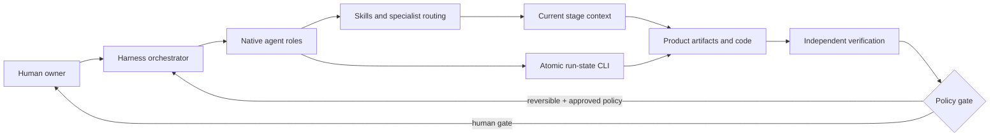

# AgenticTeam

AgenticTeam is a portable AI delivery organization for building complete platforms with
native coding-agent harnesses. Version 2 provides **46 roles**, a deterministic orchestration
state manager, autonomous and human-in-the-loop policies, independent Fusion councils, optional
BMAD-inspired progressive context, quality gates, and evidence-controlled learning.

It is intentionally more than a folder of personas. The coding harness executes the agents;
AgenticTeam supplies native role definitions, skills, task/state discipline, context contracts,
and durable artifacts so the work can survive parallelism, context loss, and human handoffs.

> “Fully autonomous” means the team can continue through reversible, in-scope local work. It
> never means unapproved production deployment, public messaging, spending, credentials/payment
> operations, destructive actions, or legal commitments.

## What is included

- **31 core roles:** leadership, product, architecture, engineering, QA, research, documentation,
  and a complete marketing organization.
- **15 conditional specialists:** integration, admin/back office, SRE, performance,
  accessibility, privacy, release, analytics, FinOps, localization, compliance, context
  engineering, system mapping, Fusion moderation, and customer success.
- **Three autonomy profiles:** `autonomous`, `supervised`, and `hitl`, backed by machine-readable
  risk policy and immutable checkpoints.
- **Fusion mode:** two or more independent proposals, simultaneous reveal, cross-critique,
  coherent synthesis, independent verification, and a preserved dissent ledger.
- **Progressive context:** short router files, numbered stage contracts, one home per fact,
  task-sized 2K–8K-token packs, and a cold walk test inspired by ICM Architect and BMAD.
- **Deterministic runtime:** atomic task claims, dependencies, path ownership, retries, lease
  recovery, stage gates, run resume, Fusion state, reports, and learning records.
- **External-skill routing with always-on floors:** `adminwright` (admin consoles),
  `design-architect` (UI systems), and Open Code Review (`ocr`) are detected at run start by
  `scripts/preflight_skills.py` and routed to when installed — while
  `protocols/admin-surfaces.md`, `interface-closure.md`, and `review-discipline.md` carry the
  same disciplines internally, so the team builds and checks the same way with none of them
  present. See [the integration plan](docs/skills-integration-plan.md).
- **Native compilers:** Claude Code, Codex, OpenCode, Google Antigravity, Gemini CLI, Pi, and a
  generic portable format.

## Architecture



The filesystem is durable coordination; the runtime is its single state writer. Native harness
subagents may work concurrently when their task dependencies and owned paths do not overlap.

## Install

Windows:

```powershell
.\scripts\install.ps1 -List
.\scripts\install.ps1 -Target C:\path\to\project -Harness codex -Preset full-platform
```

macOS/Linux:

```bash
./scripts/install.sh --list
./scripts/install.sh --target ~/project --harness claude-code --preset full-platform
```

An exact custom roster is also supported:

```powershell
.\scripts\install.ps1 -Target C:\path\to\project -Harness claude-code -Agents ceo,delivery-lead,fullstack-engineer,qa-lead,fusion-moderator
```

The installer preserves project-local knowledge and preserves existing root instructions using a
managed AgenticTeam block. It compiles the selected source roles into each harness's native
format instead of dumping the entire company into one context file.

## Start a complete build

In the installed project, ask the harness:

> Use the `agentic-build` skill. Build this platform completely in autonomous mode. Use BMAD
> progressive context and activate specialists when their triggers apply: [idea or plan].

Or initialize/resume state explicitly:

```powershell
python .agentic-team/bin/agentic_team.py init-run --project . --name "My Platform" --autonomy autonomous --entry idea --context bmad-progressive
python .agentic-team/bin/agentic_team.py status --project .
```

Most users do not need to type lifecycle commands—the orchestrator uses them. They remain visible
so the work is auditable and recoverable.

## Entry and context modes

| Entry | Behavior |
|---|---|
| `idea` | Product definition → solution → readiness → build → verify → release → learn. |
| `plan-given` | Adopt the supplied plan, run a bounded readiness pass, then execute. |
| `execute-only` | Build the supplied authority without generating a competing plan. |

`adaptive` context is suitable for clear bounded work. `bmad-progressive` activates full numbered
stage contracts and fresh context per step. Human-provided plans stay authoritative in both.

## Fusion mode

Ask:

> Use `fusion-council`. Have product, architecture, UX, security, and FinOps independently
> propose a product plan, challenge one another, then give me one coherent verified plan with
> disagreements preserved.

Fusion is useful for product direction, architecture selection, migrations, risk reviews, and
high-cost decisions. It is not used for routine tasks where debate would only add latency.

## Presets

| Preset | Purpose |
|---|---|
| `full-company` | All 46 roles; specialists still activate conditionally. |
| `full-platform` | Leadership, engineering, support, and every specialist. |
| `platform-core` | Compact core product delivery organization. |
| `fusion-product-council` | Multi-lens product/technical Fusion planning. |
| `regulated-platform` | Privacy, compliance, security, accessibility, and release depth. |
| `scale-readiness` | Reliability, performance, cost, privacy, security, and release audit. |
| `audit` | Independent brownfield/product/architecture/quality review. |
| `marketing-only` | Complete marketing organization. |
| `launch` | Product delivery plus go-to-market and customer success. |

The canonical manifest is [team.json](team.json); [team.yaml](team.yaml) is only a compatibility
pointer.

## Verification

```powershell
python scripts/agentic_team.py validate
python -m unittest discover -s tests -v
python scripts/preflight_skills.py
```

The suite compiles every harness package and tests lifecycle dependencies, conflicting path
claims, mandatory human gates, Fusion sequencing, learning, and reports.

## Documentation

- [Architecture and runtime](docs/architecture.md)
- [Autonomy, Fusion, and progressive context](docs/operating-modes.md)
- [Harness-native installation](docs/harnesses.md)
- [Runtime CLI reference](docs/cli.md)
- [Plain-language owner guide](docs/quickstart-non-dev.md)
- [Shared protocols](protocols/)
- [Third-party inspiration and licenses](THIRD_PARTY_NOTICES.md)

No agent team can guarantee a “perfect” project. AgenticTeam raises the ceiling by making claims
traceable, reviews independent, context bounded, specialist coverage explicit, and dangerous
actions human-controlled.
